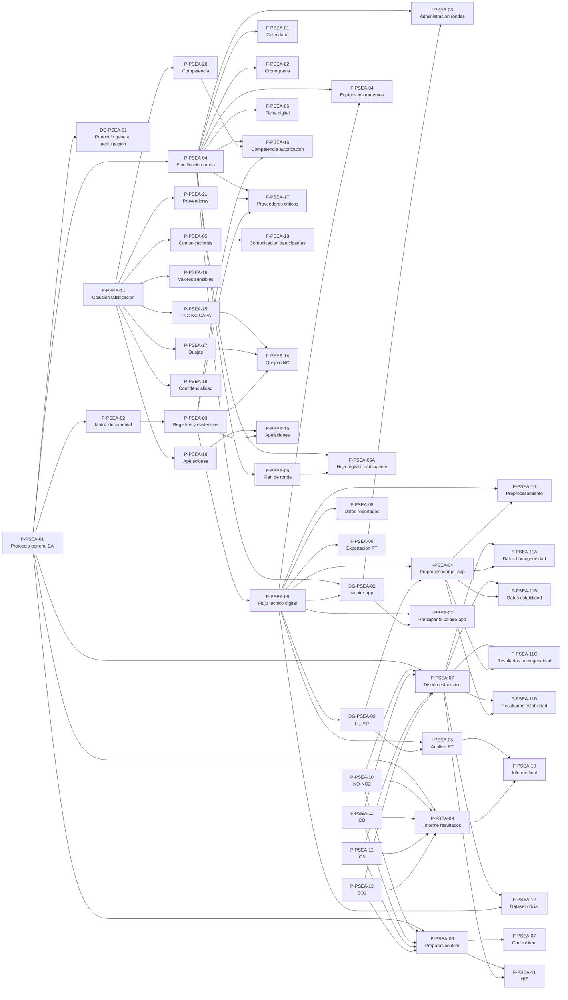

# Arbol Maestro PSEA - Sistema de Gestion de Calidad CALAIRE-EA

Actualizado: 2026-06-27  
Fuente vigente: `P-PSEA-02 Matriz documental basica del PEA` y `mapa_navegacion_sgc_pea.html`.

## Criterio

Este arbol presenta la estructura vigente de documentos controlados o reservados en `P-PSEA-02` y el flujo del mapa de navegacion.

## Estructura maestra



## Estructura operativa de ronda

Cada ronda se materializa bajo `02_despliegue_rondas/<codigo_ronda>/`. La raiz de la ronda contiene solo `checklist_ronda.md` y las siete carpetas de etapa definidas por `P-PSEA-03`:

```text
02_despliegue_rondas/<codigo_ronda>/
  checklist_ronda.md
  01_planificacion_ronda/
  02_comunicaciones_participantes/
  03_preparacion_item/
  04_datos_y_preprocesamiento/
  05_homogeneidad_estabilidad/
  06_analisis_e_informe/
  07_cierre_sgc/
```

## Nivel 1 - Documentos generales

| Codigo | Nombre | Funcion |
|---|---|---|
| `DG-PSEA-01` | Protocolo general de participacion EA | Marco de participacion y politica general. |
| `DG-PSEA-02` | Aplicativo calaire-app | Gestion de rondas, participantes, cronogramas, ficha y captura/exportacion. |
| `DG-PSEA-03` | Aplicativo pt_app | Preprocesamiento, analisis PT, H/E e informe final. |

## Nivel 2 - Procedimientos

| Grupo | Codigos | Funcion |
|---|---|---|
| Marco y control documental | `P-PSEA-01` a `P-PSEA-03` | Protocolo, matriz documental y control de registros/evidencias. |
| Operacion de ronda | `P-PSEA-04` a `P-PSEA-09` | Planificacion, comunicaciones, item, estadistica, flujo digital e informe. |
| Procedimientos tecnicos por analito | `P-PSEA-10` a `P-PSEA-13` | NO-NO2, CO, O3 y SO2. |
| Gestion | `P-PSEA-14` a `P-PSEA-21` | Colusion, NC/CAPA, valores sensibles, quejas, apelaciones, confidencialidad, competencia y proveedores. |
| Reservado | `P-PSEA-23` | Mejora continua del PEA; pendiente de integracion plena. |

## Nivel 3 - Instructivos

| Codigo | Nombre | Funcion |
|---|---|---|
| `I-PSEA-02` | Participante calaire-app | Uso por participante y reporte de datos. |
| `I-PSEA-03` | Administracion rondas calaire-app | Administracion interna de rondas y exportaciones. |
| `I-PSEA-04` | Preprocesador pt_app | Preprocesamiento, entradas, salidas, version y responsable. |
| `I-PSEA-05` | Analisis PT pt_app | Analisis estadistico y generacion de informe. |

## Nivel 4 - Formatos y registros

| Grupo | Codigos | Funcion |
|---|---|---|
| Planificacion | `F-PSEA-01`, `F-PSEA-02`, `F-PSEA-04`, `F-PSEA-05`, `F-PSEA-05A`, `F-PSEA-06`, `F-PSEA-16`, `F-PSEA-17` | Calendario, cronograma, anexo tecnico, plan, hoja participante, ficha digital, competencia y proveedores cuando aplique. |
| Datos y aplicativos | `F-PSEA-04`, `F-PSEA-08`, `F-PSEA-09`, `F-PSEA-10`, `F-PSEA-12` | Equipos, datos reportados, exportacion PT, preprocesamiento y dataset oficial. |
| Item y H/E | `F-PSEA-07`, `F-PSEA-11`, `F-PSEA-11A` a `F-PSEA-11D` | Control del item, homogeneidad y estabilidad. |
| Informe | `F-PSEA-13` | Informe final de resultados. |
| Comunicaciones | `F-PSEA-18` | Comunicaciones formales y evidencia de envio/respuesta. |
| Cierre SGC | `F-PSEA-14`, `F-PSEA-15` | Cierre documental, queja/NC y apelaciones cuando apliquen. |

## Rutas criticas del mapa

| Ruta | Secuencia |
|---|---|
| Flujo oficial de datos | `P-PSEA-08` -> `DG-PSEA-02` -> `I-PSEA-02` -> `F-PSEA-08` -> `F-PSEA-09` -> `DG-PSEA-03` -> `I-PSEA-04` -> `F-PSEA-10` -> `F-PSEA-12` -> `I-PSEA-05` -> `F-PSEA-13` |
| Homogeneidad y estabilidad | `P-PSEA-06` -> `F-PSEA-07` -> `P-PSEA-07` -> `F-PSEA-11` / `F-PSEA-11A` a `F-PSEA-11D` -> `I-PSEA-05` -> `F-PSEA-13` |
| Planificacion de ronda | `P-PSEA-04` -> `P-PSEA-05` -> `DG-PSEA-02` -> `I-PSEA-03` -> `F-PSEA-06` -> `F-PSEA-01` -> `F-PSEA-02` -> `F-PSEA-04` -> `F-PSEA-05` -> `F-PSEA-05A` -> `F-PSEA-16` -> `F-PSEA-17` -> `F-PSEA-18` -> `P-PSEA-06` |
| Estructura de ronda | `P-PSEA-03` -> `P-PSEA-05` -> `F-PSEA-01` -> `F-PSEA-02` -> `F-PSEA-04` -> `F-PSEA-05` -> `F-PSEA-05A` -> `F-PSEA-06` -> `F-PSEA-16` -> `F-PSEA-17` -> `F-PSEA-18` -> `F-PSEA-07` -> `F-PSEA-08` -> `F-PSEA-09` -> `F-PSEA-10` -> `F-PSEA-12` -> `F-PSEA-11` -> `F-PSEA-11A` a `F-PSEA-11D` -> `F-PSEA-13` -> `F-PSEA-14` -> `F-PSEA-15` |
| Cierre y gestion SGC | `P-PSEA-03` -> `P-PSEA-14` / `P-PSEA-15` / `P-PSEA-17` / `P-PSEA-18` / `P-PSEA-20` / `P-PSEA-21` -> `F-PSEA-14` / `F-PSEA-15` / `F-PSEA-16` / `F-PSEA-17` |
