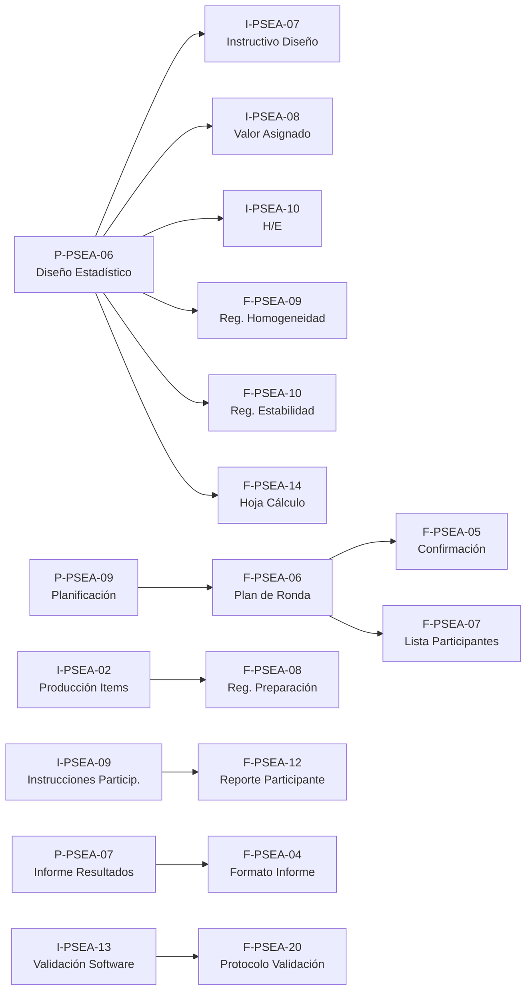

# Plan de Creación de Documentación Técnica — Prueba Piloto PSEA

## Contexto

La prueba piloto del PSEA requiere documentación técnica-operativa para ser ejecutable, trazable y consistente con ISO/IEC 17043:2023 e ISO 13528:2022. Existen **52 placeholders** (ya segregados en operativos y gestión). Los documentos de **gestión** (16) ya fueron movidos a `gestion/`. Este plan se enfoca exclusivamente en los **documentos generales, procedimientos, instructivos y formatos técnicos** requeridos para operar las rondas piloto.

### Nomenclatura documental vigente

La nomenclatura de archivo debe seguir las plantillas ubicadas en `docs/documentacion_sgc/01_bloque_general/00_plantillas_base/`, que constituyen la referencia operativa para el Sistema de Gestión:

| Nivel | Plantilla base | Uso documental | Regla de nombre para nuevos archivos |
|---|---|---|---|
| Documento general | `DG-PSEA- Documento General.docx` | Política, protocolo marco, lineamiento transversal del esquema | `DG-PSEA-## Nombre Documento General.docx` cuando el documento tenga código asignado; si el código está pendiente, mantener `DG-PSEA- Nombre Documento General.docx` como borrador controlado |
| Procedimiento | `P-PSEA-01 Plantilla Procedimiento.doc` | Define qué se hace, responsables, entradas, salidas, registros y control del proceso | `P-PSEA-## Nombre Procedimiento.docx` |
| Instructivo | `I-PSEA-01 Plantilla Instructivo.doc` | Describe cómo ejecutar una actividad técnica específica | `I-PSEA-## Nombre Instructivo.docx` |
| Formato / registro | `F-PSEA-01 Plantilla Formato_Excel.xlsx` | Captura evidencia objetiva o datos operativos de una ronda | `F-PSEA-## Nombre Formato.xlsx` |

**Criterio de aplicación:** el código documental no debe cambiar entre versiones ni entre formatos de trabajo. Las copias operativas por ronda deben conservar el código maestro y agregar un sufijo de contexto solo después del título, por ejemplo `F-PSEA-06 Ficha digital de ronda EA_Ronda 7.xlsx`. Los archivos Markdown usados en el grafo son borradores de trabajo o transcripciones; el archivo controlado del SGC debe quedar en Word o Excel según la plantilla base.

### Estado actual

| Categoría | Existentes (draft .docx/.xlsx) | Placeholders (por crear) | Plantilla base |
|---|---|---|---|
| Documento general (DG-PSEA) | 1 documento marco existente | Actualizar si cambia alcance del piloto | `DG-PSEA- Documento General.docx` |
| Procedimientos técnicos (P-PSEA) | 9 existentes (01–09) | 3 nuevos (10, 20, 22) | `P-PSEA-01 Plantilla Procedimiento.doc` |
| Instructivos técnicos (I-PSEA) | 1 existente (01 Embalaje) | 14 nuevos (02–15) | `I-PSEA-01 Plantilla Instructivo.doc` |
| Formatos/Registros (F-PSEA) | 4 existentes (01–04) | 19 nuevos (05–23) | `F-PSEA-01 Plantilla Formato_Excel.xlsx` |

### Rondas planeadas

| | Ronda Simple | Ronda Compleja F1 | Ronda Compleja F2 |
|---|---|---|---|
| Analitos | CO, SO₂ | O₃, NO, NO₂ | CO, SO₂ |
| Participantes | P1 (SIATA) | P1 + P2 (UPB) | P2 (UPB) |

---

## Diagnóstico: ¿Qué se necesita para ejecutar la prueba piloto?

### Bloque A — Procedimientos e instructivos que deben existir ANTES de arrancar

> Sin estos documentos no se puede planificar, ni operar, ni calcular resultados.

#### A0. Documento general que requiere control de alcance

| Código | Documento | Archivo objetivo | Qué falta | Est. horas |
|---|---|---|---|---|
| DG-PSEA-01 | Protocolo Participación EA Gases Contaminantes Criterio | `DG-PSEA-01 Protocolo Participacion EA Gases Contaminantes Criterio.docx` | Confirmar que el alcance de la prueba piloto, la segregación de rondas y la codificación P1/P2 queden alineadas con los procedimientos P-PSEA aplicables | 3h |

#### A1. Procedimientos existentes que requieren mejora

| Código | Documento | Archivo objetivo | Qué falta | Est. horas |
|---|---|---|---|---|
| P-PSEA-09 | Generación/emisión del informe de resultados | `P-PSEA-09 Generacion emision del informe de resultados.docx` | Expandir literales a)–u) de §7.2.1.3; resolver duplicidad de versiones | 4h |
| P-PSEA-06 | Procedimiento de Diseño Estadístico | `P-PSEA-06 Procedimiento de Diseño Estadistico.docx` | Fijar σ_pt, modelo u(x_pt), scoring para n bajo; revisión editorial | 6h |
| P-PSEA-07 | Procedimiento de Informe de Resultados | `P-PSEA-07 Procedimiento de Informe de Resultados.docx` | Contenido mínimo §7.4.3, plazos, informes corregidos | 3h |
| P-PSEA-02–05 | Procedimientos por analito | `P-PSEA-02 Procedimiento de Ensayo de Aptitud para NO-NO2.docx`; `P-PSEA-03 Procedimiento de Ensayo de Aptitud para CO.docx`; `P-PSEA-04 Procedimiento de Ensayo de Aptitud para O3.docx`; `P-PSEA-05 Procedimiento de Ensayo de Aptitud para SO2.docx` | Verificar coherencia con secuencia piloto, niveles, CRM y criterios de evaluación | 2h c/u (8h) |

#### A2. Procedimientos nuevos (placeholders → drafts)

| Código | Documento | Archivo objetivo | Contenido clave | Est. horas |
|---|---|---|---|---|
| P-PSEA-10 | Procedimiento de Manejo de Ítems PT | `P-PSEA-10 Procedimiento de Manejo de Items PT.docx` | Identificación, almacenamiento, despacho/recepción de cilindros y equipos in situ | 3h |
| P-PSEA-20 | Procedimiento de Comunicación PT | `P-PSEA-20 Procedimiento de Comunicacion PT.docx` | Revisión de solicitudes, instrucciones pre-ronda, acuerdos con participantes | 3h |
| P-PSEA-22 | Procedimiento de Reportes PT | `P-PSEA-22 Procedimiento de Reportes PT.docx` | Contenido mínimo de reportes §7.4.3, plazos, distribución | 3h |

#### A3. Instructivos técnicos nuevos (placeholder → draft)

Estos son las "recetas" operativas paso a paso — son los que el personal del PEA sigue durante la ronda.

| Código | Documento | Archivo objetivo | Contenido clave | Prioridad | Est. horas |
|---|---|---|---|---|---|
| **I-PSEA-10** | Homogeneidad y Estabilidad | `I-PSEA-10 Homogeneidad y Estabilidad.docx` | ≥10 atmósferas, réplicas, s_hom ≤ 0,3×σ_pt, 3 modalidades estabilidad | 🔴 Crítica | 4h |
| **I-PSEA-02** | Producción de Ítems PT | `I-PSEA-02 Produccion de Items PT.docx` | Generación de atmósferas, CRM, dilución dinámica, setpoints | 🔴 Crítica | 4h |
| **I-PSEA-08** | Valor Asignado | `I-PSEA-08 Valor Asignado.docx` | Jerarquía (CRM → referencia → consenso), modelo u(x_pt) | 🔴 Crítica | 3h |
| **I-PSEA-07** | Diseño Estadístico | `I-PSEA-07 Diseño Estadistico.docx` | Procedimiento ISO 13528, Algoritmo A/B, revisión inicial | 🔴 Crítica | 3h |
| **I-PSEA-09** | Instrucciones a Participantes | `I-PSEA-09 Instrucciones a Participantes.docx` | Qué medir, cómo reportar, plazos, formato, cifras significativas | 🟠 Alta | 3h |
| **I-PSEA-11** | Análisis de Datos | `I-PSEA-11 Analisis de Datos.docx` | Revisión, outliers, selección de algoritmo, documentación | 🟠 Alta | 3h |
| **I-PSEA-12** | Evaluación de Desempeño | `I-PSEA-12 Evaluacion de Desempeño.docx` | Cálculo z, z', ζ, interpretación, clasificación | 🟠 Alta | 3h |
| **I-PSEA-13** | Validación de Software y Sistemas | `I-PSEA-13 Validacion de Software y Sistemas.docx` | Expediente aplicativo R/Shiny, datasets referencia, tolerancia 1e-9 | 🔴 Crítica | 5h |
| **I-PSEA-15** | Caracterización | `I-PSEA-15 Caracterizacion.docx` | Caracterización CRM y atmósferas generadas | 🟡 Media | 2h |
| **I-PSEA-03** | Control Ambiental | `I-PSEA-03 Control Ambiental.docx` | Condiciones T, P, HR durante generación | 🟡 Media | 2h |
| **I-PSEA-04** | Validación de Métodos | `I-PSEA-04 Validacion de Metodos.docx` | Validación métodos de ensayo | 🟡 Media | 2h |
| **I-PSEA-05** | Estimación de Incertidumbre | `I-PSEA-05 Estimacion de Incertidumbre.docx` | Modelo u(x_pt) = √(u²_char + u²_hom + u²_stab) | 🟡 Media | 2h |
| **I-PSEA-06** | Control de Calidad de Datos | `I-PSEA-06 Control de Calidad de Datos.docx` | QC de datos, consistencia, revisión de unidades | 🟡 Media | 2h |
| **I-PSEA-14** | Visualización de Datos y Gráficos | `I-PSEA-14 Visualizacion de Datos y Graficos.docx` | Especificaciones de gráficos del informe | 🟡 Media | 2h |

---

### Bloque B — Formatos de ejecución (registros de la ronda)

> Estos son los formularios que se llenan durante la ejecución de cada ronda. Requieren una plantilla maestra y luego copias adaptadas por ronda.

| Código | Formato | Archivo objetivo maestro | Contenido clave | Tipo archivo | Est. horas |
|---|---|---|---|---|---|
| **F-PSEA-05** | Confirmación de Participación | `F-PSEA-05 Confirmacion de Participacion.xlsx` | Datos participante, analitos aceptados, acuerdo | .xlsx | 2h |
| **F-PSEA-06** | Ficha digital de ronda EA | `F-PSEA-06 Ficha digital de ronda EA.xlsx` | Participantes, analitos, niveles, CRM, responsables, fechas | .xlsx | 3h |
| **F-PSEA-07** | Lista Maestra de Participantes | `F-PSEA-07 Lista Maestra de Participantes.xlsx` | Código anónimo, contacto, estado confirmación | .xlsx | 1h |
| **F-PSEA-08** | Registro de Preparación del Ítem | `F-PSEA-08 Registro de Preparacion del Item.xlsx` | CRM, certificado, dilución, caudales, concentración, T/P/HR | .xlsx | 3h |
| **F-PSEA-09** | Registro de Homogeneidad | `F-PSEA-09 Registro de Homogeneidad.xlsx` | ≥10 mediciones, método referencia, réplicas, s_hom, criterio | .xlsx | 2h |
| **F-PSEA-10** | Registro de Estabilidad | `F-PSEA-10 Registro de Estabilidad.xlsx` | Mediciones inicio/fin, criterio \|x̄_i − x̄_f\| ≤ 0,3×σ_pt | .xlsx | 2h |
| **F-PSEA-11** | Registro de Envío y Recepción | `F-PSEA-11 Registro de Envio y Recepcion.xlsx` | Equipos instalados, confirmación, condiciones | .xlsx | 2h |
| **F-PSEA-12** | Reporte del Participante | `F-PSEA-12 Reporte del Participante.xlsx` | Resultado, incertidumbre, método, equipo, observaciones | .xlsx | 3h |
| **F-PSEA-13** | Informe final de resultados | `F-PSEA-13 Informe final de resultados.xlsx` | Checklist: unidades, plausibilidad, cifras, exclusiones | .xlsx | 2h |
| **F-PSEA-14** | Registro/caso de queja o NC según aplique | `F-PSEA-14 Registro caso de queja o NC segun aplique.xlsx` | x_pt, σ_pt, z-score, aprobación, firma | .xlsx | 3h |

### Bloque C — Formatos de cierre/soporte

> No bloquean el arranque pero son necesarios para el cierre documental.

| Código | Formato | Archivo objetivo maestro | Est. horas |
|---|---|---|---|
| F-PSEA-15 | Registro de No Conformidad CAPA | `F-PSEA-15 Registro de No Conformidad CAPA.xlsx` | 1h |
| F-PSEA-16 | Registro de Quejas | `F-PSEA-16 Registro de Quejas.xlsx` | 1h |
| F-PSEA-17 | Registro de Apelaciones | `F-PSEA-17 Registro de Apelaciones.xlsx` | 1h |
| F-PSEA-18 | Acta de Revisión por la Dirección | `F-PSEA-18 Acta de Revision por la Direccion.xlsx` | 1h |
| F-PSEA-19 | Lista de Verificación Auditoría Interna | `F-PSEA-19 Lista de Verificacion Auditoria Interna.xlsx` | 2h |
| F-PSEA-20 | Protocolo de Validación de Software | `F-PSEA-20 Protocolo de Validacion de Software.xlsx` | 3h |
| F-PSEA-21 | Matriz de Competencia y Autorización | `F-PSEA-21 Matriz de Competencia y Autorizacion.xlsx` | 2h |
| F-PSEA-22 | Matriz de Riesgos de Imparcialidad | `F-PSEA-22 Matriz de Riesgos de Imparcialidad.xlsx` | 2h |
| F-PSEA-23 | Evaluación de Proveedores Externos | `F-PSEA-23 Evaluacion de Proveedores Externos.xlsx` | 1h |

---

## Plan de creación por sprints

### Sprint 1 — Núcleo estadístico y planificación (semana 1)

> **Objetivo:** tener los procedimientos troncales listos para definir la ronda.

| # | Documento | Tipo | Acción |
|---|---|---|---|
| 1 | DG-PSEA-01 | Documento general | Verificar alcance y relación con prueba piloto |
| 2 | P-PSEA-09 | Procedimiento | Consolidar versión única + expandir |
| 3 | P-PSEA-06 | Procedimiento | Mejora editorial + fijar σ_pt para piloto |
| 4 | I-PSEA-07 | Instructivo | Crear: diseño estadístico paso a paso |
| 5 | I-PSEA-08 | Instructivo | Crear: cálculo de valor asignado |
| 6 | I-PSEA-10 | Instructivo | Crear: homogeneidad y estabilidad |

**Horas estimadas:** ~23h  
**Entregable:** Criterios técnicos fijados; se puede diseñar F-PSEA-06 (plan de ronda).

---

### Sprint 2 — Producción e instrucciones (semana 2)

> **Objetivo:** tener la cadena operativa de generación + instrucciones a participantes.

| # | Documento | Tipo | Acción |
|---|---|---|---|
| 1 | I-PSEA-02 | Instructivo | Crear: producción de atmósferas |
| 2 | I-PSEA-09 | Instructivo | Crear: instrucciones a participantes |
| 3 | P-PSEA-20 | Procedimiento | Crear: comunicación con participantes |
| 4 | P-PSEA-10 | Procedimiento | Crear: manejo de ítems PT |
| 5 | I-PSEA-13 | Instructivo | Crear: validación de software (fase 1) |
| 6 | P-PSEA-02–05 | Procedimiento | Verificar coherencia con rondas |

**Horas estimadas:** ~22h  
**Entregable:** Se puede enviar invitación formal a participantes y ejecutar la validación del aplicativo.

---

### Sprint 3 — Formatos de ejecución (semana 3)

> **Objetivo:** tener todos los formularios listos para llenar durante la ronda.

| # | Documento | Tipo | Acción |
|---|---|---|---|
| 1 | F-PSEA-06 | Formato | Crear: plan de ronda |
| 2 | F-PSEA-05 | Formato | Crear: confirmación participación |
| 3 | F-PSEA-07 | Formato | Crear: lista participantes |
| 4 | F-PSEA-08 | Formato | Crear: registro preparación ítem |
| 5 | F-PSEA-09 | Formato | Crear: registro homogeneidad |
| 6 | F-PSEA-10 | Formato | Crear: registro estabilidad |
| 7 | F-PSEA-11 | Formato | Crear: registro envío/recepción |
| 8 | F-PSEA-12 | Formato | Crear: reporte del participante |
| 9 | F-PSEA-13 | Formato | Crear: hoja revisión datos |
| 10 | F-PSEA-14 | Formato | Crear: hoja cálculo estadística |

**Horas estimadas:** ~23h  
**Entregable:** Paquete completo de formatos listo para copiar a carpetas por ronda.

---

### Sprint 4 — Informe, análisis y cierre (semana 4)

> **Objetivo:** cerrar la cadena desde análisis hasta informe + formatos de soporte.

| # | Documento | Tipo | Acción |
|---|---|---|---|
| 1 | P-PSEA-07 | Procedimiento | Actualizar informe de resultados |
| 2 | P-PSEA-22 | Procedimiento | Crear: reportes PT |
| 3 | I-PSEA-11 | Instructivo | Crear: análisis de datos |
| 4 | I-PSEA-12 | Instructivo | Crear: evaluación de desempeño |
| 5 | I-PSEA-14 | Instructivo | Crear: visualización de datos |
| 6 | F-PSEA-20 | Formato | Crear: protocolo validación software |
| 7 | F-PSEA-15–19 | Formatos | Crear: formatos cierre (NC, quejas, apelaciones, acta, auditoría) |

**Horas estimadas:** ~18h  

---

### Sprint 5 — Instructivos complementarios + copias por ronda (semana 5)

> **Objetivo:** completar instructivos de prioridad media y poblar carpetas por ronda.

| # | Documento | Tipo | Acción |
|---|---|---|---|
| 1 | I-PSEA-15 | Instructivo | Crear: caracterización |
| 2 | I-PSEA-03 | Instructivo | Crear: control ambiental |
| 3 | I-PSEA-04 | Instructivo | Crear: validación de métodos |
| 4 | I-PSEA-05 | Instructivo | Crear: estimación incertidumbre |
| 5 | I-PSEA-06 | Instructivo | Crear: control calidad de datos |
| 6 | F-PSEA-21–23 | Formatos | Crear: matrices y evaluación proveedores |
| 7 | — | Copias | Poblar `ronda_simple/`, `ronda_compleja_fase1/`, `ronda_compleja_fase2/` con F-PSEA-05 a F-PSEA-14 adaptados |

**Horas estimadas:** ~16h  

---

## Resumen de esfuerzo

| Sprint | Foco | Horas | Docs |
|---|---|---|---|
| 1 | Núcleo estadístico | ~23h | 6 |
| 2 | Producción e instrucciones | ~22h | 6+ |
| 3 | Formatos de ejecución | ~23h | 10 |
| 4 | Informe, análisis, cierre | ~18h | 7+ |
| 5 | Complementarios + rondas | ~16h | 6+ copias |
| **Total** | | **~102h** | **~36 docs nuevos + 10 mejoras** |

---

## Dependencias clave

## Verificación

### Al final de cada sprint
- [ ] Cada documento tiene: código, versión, fecha, cláusulas ISO cubiertas, responsable
- [ ] Nombre de archivo consistente con `docs/documentacion_sgc/01_bloque_general/00_plantillas_base/` y con la codificación DG-PSEA/P-PSEA/I-PSEA/F-PSEA del Diccionario
- [ ] Trazabilidad normativa verificable contra [trazabilidad_normativa_sgc.md](file:///home/w182/w421/calaire-ea/docs/documentacion_sgc/01_bloque_general/05_matrices_inventarios/trazabilidad_normativa_sgc.md)

### Al final del plan completo
- [ ] 36 documentos operativos existentes en `docs/documentacion_sgc/02_prueba_piloto_rondas/`
- [ ] Carpetas `ronda_simple/`, `ronda_compleja_fase1/`, `ronda_compleja_fase2/` pobladas con F-PSEA-05 a F-PSEA-14 adaptados
- [ ] Revisión cruzada procedimiento ↔ instructivo ↔ formato (cada formato soporta un instructivo que ejecuta un procedimiento)
- [ ] Simulacro documental: recorrer la cadena con un analito ficticio desde planificación hasta informe
