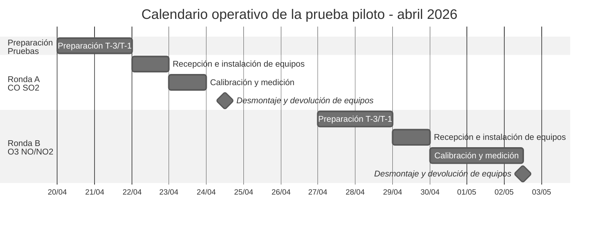

# Informe Operativo de la Prueba Piloto CALAIRE-EA

project:: [[CALAIRE-EA]]
type:: [[Informe Operativo]]
status:: draft
date:: 2026-05-06

## 1. Resumen ejecutivo

Este informe consolida la ejecución operativa de la [[Prueba Piloto]] del esquema [[CALAIRE-EA]] para ensayos de aptitud en gases contaminantes criterio. El documento se concentra en la planificación, alistamiento, instalación, medición, desmontaje, gestión de participantes y control documental de las rondas efectivamente desarrolladas durante abril de 2026.

La prueba piloto cubrió dos ciclos operativos principales. La [[Ronda A]] correspondió a una ronda simple con [[SIATA]] como participante P1 para CO y SO2, con montaje el 2026-04-22, medición el 2026-04-23 y cierre logístico el 2026-04-24. La [[Ronda B]] fue planificada inicialmente como ronda compleja para O3, NO y NO2, con participación prevista de [[SIATA]] como P1 y [[Universidad Pontificia Bolivariana]] como P2. Durante la ejecución se documentó la participación efectiva de P1 y el diferimiento de P2 a una ronda posterior, por lo cual la ronda se ejecutó operativamente como ronda simple. La ejecución técnica y la devolución de equipos de la [[Ronda B]] finalizaron el sábado 2026-05-02.

El resultado operativo principal es la verificación práctica del flujo de preparación, instalación, calibración previa de analizadores, generación del ítem de ensayo, medición con el participante, desmontaje y cierre de registros. Por tratarse de un piloto, las conclusiones estadísticas se consideran formativas y no constituyen una evaluación regular de desempeño interlaboratorio.

## 2. Antecedentes y marco operativo

La prueba piloto se ejecutó como actividad de verificación del esquema de ensayos de aptitud del proyecto 61134, orientado a establecer capacidades técnicas y documentales para gases contaminantes criterio en Colombia. Su función fue probar el sistema bajo condiciones operativas reales antes de consolidar rondas regulares, incluyendo interacción con laboratorios participantes, preparación del ítem PT, uso de formatos PSEA, aplicación de criterios estadísticos y cierre de registros.

El marco técnico se apoya en ISO/IEC 17043:2023 para requisitos de proveedores de ensayos de aptitud y en ISO 13528:2022 para diseño estadístico, valores asignados, incertidumbre, desviación típica para evaluación de desempeño y criterios de interpretación.

## 3. Alcance de rondas ejecutadas

| Ronda | Tipo operativo final | Fechas operativas | Participantes previstos | Participantes efectivos | Contaminantes |
|---|---|---|---|---|---|
| [[Ronda A]] | Simple | 2026-04-22 a 2026-04-24 | P1 = [[SIATA]] | P1 = [[SIATA]] | CO, SO2 |
| [[Ronda B]] | Simple, derivada de una ronda inicialmente compleja | 2026-04-29 a 2026-05-02 | P1 = [[SIATA]], P2 = [[Universidad Pontificia Bolivariana]] | P1 = [[SIATA]]; P2 diferido | O3, NO, NO2 |

La separación entre participantes previstos y participantes efectivos es un control crítico del informe. Esta distinción evita mezclar la planificación inicial con la ejecución real y permite conservar evidencia de la modificación operativa de la [[Ronda B]].

No se incluyen rondas canceladas o escenarios previos de programación, porque no hacen parte del desarrollo operativo ejecutado que se documenta en este informe.

### 3.1 Equipos de referencia documentados

La tabla de instrumentación se construye a partir del apartado 1.5 "Participantes e Instrumentación" del informe SGC `Informe_EA_2025-12-10_13-z-3-3.docx`. Ese documento identifica los analizadores de referencia por contaminante, mientras que los equipos de participantes aparecen como información pendiente de cada laboratorio. Por tanto, en este informe operativo se registra únicamente la instrumentación de referencia confirmada documentalmente.

| Ronda piloto | Contaminante | Equipo de referencia documentado | Función operativa |
|---|---|---|---|
| [[Ronda A]] | SO2 | HORIBA APSA-370 | Analizador de referencia para contraste de medición de SO2 |
| [[Ronda A]] | CO | Teledyne T300 | Analizador de referencia para contraste de medición de CO |
| [[Ronda B]] | O3 | Thermo 49i | Analizador de referencia para contraste de medición de O3 |
| [[Ronda B]] | NO/NO2 | HORIBA APSA-370 | Analizador de referencia para contraste de medición de NO y NO2 |

Los modelos específicos de los analizadores aportados por [[SIATA]] deben cerrarse contra F-PSEA-05/F-PSEA-05A y F-PSEA-07, porque la fuente SGC consultada conserva esos campos como información de participante y no como inventario confirmado.

## 4. Invitación y gestión de participantes

La estrategia de participación se basó en invitación directa a laboratorios con experiencia operativa en medición de gases contaminantes criterio y capacidad para instalar analizadores automáticos en el entorno de prueba. Las comunicaciones oficiales debían establecer alcance técnico, calendario, condiciones de ingreso, responsabilidades del participante, confidencialidad, reporte de resultados y tratamiento de incertidumbre.

[[SIATA]] quedó definido como participante P1 para las dos rondas activas del piloto. Su participación permitió verificar el flujo completo de interacción entre el laboratorio participante y el equipo CALAIRE, desde la preparación pre-ronda hasta la entrega de resultados y cierre logístico.

[[Universidad Pontificia Bolivariana]] quedó definida inicialmente como P2 para la ronda compleja. Sin embargo, los registros de ejecución documentan el diferimiento de P2 por requerimiento interno del cliente, por lo cual la ejecución efectiva de esa fase quedó restringida a P1.

| Registro | Función operativa | Estado de control |
|---|---|---|
| F-PSEA-05 / F-PSEA-05A | Confirmación de participación y datos del laboratorio | Requiere cierre por participante y ronda |
| F-PSEA-07 | Lista maestra de participantes y codificación P1/P2 | Debe reflejar participantes previstos y efectivos |
| P-PSEA-20 | Comunicaciones del ensayo de aptitud | Soporte para trazabilidad de invitaciones e instrucciones |
| I-PSEA-09 | Instrucciones a participantes | Control de preparación, medición, reporte y confidencialidad |

## 5. Planificación operativa

La planificación de las rondas se documentó mediante F-PSEA-06 como formato principal de control. Este registro consolida identificación de ronda, tipo de operación, analitos, participantes, personal autorizado, recursos críticos, criterios de aceptación y cronograma.

| Elemento | [[Ronda A]] | [[Ronda B]] |
|---|---|---|
| Código de referencia | EA-PP2026-R1 | EA-PP2026-R2 |
| Tipo de operación planificada | Ronda simple de participante único | Ronda compleja prevista como multi-participante |
| Tipo de operación ejecutada | Ronda simple | Ronda simple con P1 efectivo |
| Instalación | 2026-04-22 | 2026-04-29 |
| Medición | 2026-04-23 | 2026-04-30 a 2026-05-02 |
| Cierre logístico | 2026-04-24 | 2026-05-02 |
| Devolución de equipos | 2026-04-24 | 2026-05-02 |
| Recursos principales | CRM CO/SO2, sistema de dilución, manifold, aire cero, monitoreo ambiental | Generación O3, CRM NO/NO2, sistema de dilución, manifold, calibrador dinámico |

La preparación incluyó verificación de infraestructura, condiciones de acceso, disponibilidad de manifold, compatibilidad de puertos, estado de equipos de generación, control de CRM y definición de roles.

Los cilindros o recursos propios de los participantes fueron empleados por los participantes para sus rutinas de calibración antes del inicio de la ronda. Estos recursos no reemplazan la preparación del ítem de ensayo de CALAIRE, pero sí hacen parte del alistamiento operativo del laboratorio participante.

## 6. Planificación estadística

El diseño estadístico de la prueba piloto se estructuró con valor asignado de referencia trazable, incertidumbre del valor asignado y desviación típica para evaluación del desempeño. Dado el número bajo de participantes, no se considera apropiado usar consenso interlaboratorio como base primaria del valor asignado. El enfoque operativo corresponde a valor de referencia definido desde el laboratorio de referencia y el sistema de generación/dilución.

| Componente | Criterio aplicado en el piloto | Control pendiente o requerido |
|---|---|---|
| Valor asignado `x_pt` | Referencia trazable por CRM y sistema de generación/dilución | Confirmar por contaminante y nivel en F-PSEA-14 |
| Incertidumbre `u(x_pt)` | Derivada de la trazabilidad, generación, dilución y control de estabilidad | Documentar presupuesto o referencia técnica |
| `sigma_pt` | Enfoque prescrito de aptitud para el propósito | Cerrar coherencia entre F-PSEA-06, I-PSEA-07 e I-PSEA-09 |
| Score | `z'` o `zeta` según incertidumbre disponible y criterio de evaluación | Definir explícitamente antes de emisión de resultados |
| Interpretación | Formativa, no concluyente como ronda regular | Declarar limitación por número bajo de participantes |

Esta sección delimita el enfoque estadístico general. El análisis detallado de resultados, cálculo de desempeño y emisión de salidas formales no hacen parte del alcance principal de este informe operativo.

## 7. Calendario y control de hitos

El calendario operativo debe conservar una secuencia explícita de preparación, ejecución y cierre. En especial, se incluye el hito T-3 como control documental requerido para evitar brechas de preparación pre-ronda.

| Hito | Control operativo |
|---|---|
| T-14 | Envío de instrucciones, calendario preliminar y condiciones de participación |
| T-7 | Confirmación de participantes, equipos, personal visitante y requisitos de ingreso |
| T-3 | Verificación documental final de prerrequisitos, recursos críticos y cambios |
| T-1 | Confirmación logística, punto de encuentro, horario y estado de preparación |
| Día 0 | Recepción, instalación, asignación de puerto y acondicionamiento |
| Calibración | Calibración de analizadores antes del inicio de la ronda |
| Medición | Ejecución de secuencia por contaminante, nivel y ventana de estabilidad |
| Post-ronda | Desmontaje y retiro de instrumentos |

El siguiente calendario consolida únicamente la programación operativa relevante para el desarrollo de la prueba piloto en abril y cierre inmediato de la [[Ronda B]]:

## 8. Desarrollo de la ejecución

### 8.1 Ronda A: CO y SO2

La [[Ronda A]] se desarrolló como ronda simple orientada a verificar el flujo básico de participación con un laboratorio. El montaje incluyó recepción de equipos, ubicación en el área de trabajo, conexión al sistema de distribución, acondicionamiento y verificación funcional previa. La medición se concentró en CO y SO2, con generación de atmósfera gaseosa in situ y control de condiciones operativas.

El cierre logístico comprendió retiro de equipos. Esta ronda permitió probar el flujo mínimo de operación del esquema antes de la ronda con mayor complejidad instrumental.

### 8.2 Ronda B: O3, NO y NO2

La [[Ronda B]] fue planificada como ronda compleja por la coordinación prevista de dos participantes, donde uno de ellos participaría solo en la primera parte del ensayo. La ejecución efectiva quedó restringida a [[SIATA]] como P1, con [[Universidad Pontificia Bolivariana]] diferida a una ronda posterior. Por ello, la ronda pasó a ser una ronda simple en términos de participación efectiva.

La operación incluyó preparación de generación de O3, NO y NO2, calibración previa de analizadores, verificación de estabilidad, secuencia de medición por jornada y control de reportes. La secuencia técnica culminó el sábado 2026-05-02, fecha que marca tanto el cierre operativo de la ronda como la devolución de equipos.

## 9. Registros fotográficos

Los registros fotográficos deben usarse como evidencia complementaria de instalación, calibración previa, configuración de analizadores, operación simultánea del participante y la referencia, y cierre logístico. No sustituyen los registros técnicos F-PSEA, pero fortalecen la trazabilidad visual de la ejecución.

### 9.1 Ronda A

| Registro fotográfico | Descripción técnica |
|---|---|
| Foto RA-01 | Recepción e instalación de equipos de [[SIATA]] en el área de prueba para CO y SO2. |
| Foto RA-02 | Calibración de los analizadores de CO y SO2 antes del inicio de la ronda. |
| Foto RA-03 | Instrumentos del participante y referencia operando simultáneamente para CO y SO2. |

### 9.2 Ronda B

| Registro fotográfico | Descripción técnica |
|---|---|
| Foto RB-01 | Recepción e instalación de equipos de [[SIATA]] en el área de prueba para O3, NO y NO2. |
| Foto RB-02 | Calibración de los analizadores de O3, NO y NO2 antes del inicio de la ronda. |
| Foto RB-03 | Instrumentos del participante y referencia operando simultáneamente para O3, NO y NO2. |

## 10. Incidentes, desviaciones y cambios controlados

El principal cambio operativo identificado corresponde al diferimiento de [[Universidad Pontificia Bolivariana]] en la [[Ronda B]]. Este evento debe quedar registrado como modificación de participación efectiva y no como falla de medición del ítem de ensayo.

La consecuencia directa del cambio fue la transformación del alcance operativo de la [[Ronda B]]: pasó de una ronda compleja prevista con dos participantes a una ronda ejecutada con un participante efectivo. Esta condición debe conservarse en F-PSEA-07 y en los registros de ejecución de la ronda.

## 11. Aprendizajes operativos de las rondas

La ejecución de las rondas piloto permitió identificar lecciones críticas sobre la duración real de las operaciones frente a la programación teórica. Estos hallazgos deben incorporarse como insumos obligatorios en la planificación de rondas regulares posteriores.

### 11.1 Duración mínima de una ronda completa

Se concluye que se requiere al menos la semana completa para ejecutar una ronda de ensayo de aptitud, desde la recepción e instalación de equipos hasta el cierre logístico y la devolución de instrumentos. La programación original no contempló márgenes suficientes para las operaciones de estabilización entre niveles de concentración ni para las verificaciones de homogeneidad y estabilidad del ítem de ensayo, lo cual generó presión sobre el cronograma y riesgo de compromiso en la calidad de los datos de medición.

### 11.2 Tiempo de estabilización entre niveles de concentración

Entre cada cambio de nivel de concentración de contaminante es necesario dejar un periodo mínimo de 15 minutos para que la señal del analizador se estabilice y los datos registrados alcancen un estado consistente. Este requisito aplica de forma individual por cada transición de nivel dentro de la secuencia de un mismo gas, y no es compresible sin afectar la integridad metrológica del resultado.

### 11.3 Pruebas de homogeneidad y estabilidad del ítem PT

Conforme a los requisitos de ISO/IEC 17043:2023 e ISO 13528:2022, el proveedor de ensayos de aptitud debe verificar que el ítem PT sea suficientemente homogéneo entre unidades y estable en el tiempo. Estas verificaciones se realizan antes y después del periodo de medición del participante, y deben cubrir todos los contaminantes y todos los niveles de concentración incluidos en la ronda.

La prueba de **homogeneidad** confirma que las diferentes porciones o puntos de muestreo del ítem PT entregan resultados equivalentes, garantizando que las diferencias observadas entre participantes se deben a su desempeño y no a variaciones en el ítem recibido. La prueba de **estabilidad** confirma que la concentración del analito no varía de forma significativa durante la ventana de exposición, desde la preparación hasta el cierre de la medición.

Ambas pruebas exigen una secuencia completa de generación, estabilización y medición para cada gas y cada nivel, lo cual implica un consumo temporal adicional sustancial antes y después de las mediciones del participante. En la práctica, esto significa que el tiempo operativo de una ronda no se limita al periodo en que el participante mide, sino que incluye necesariamente las verificaciones pre-ronda y post-ronda de cada combinación contaminante–nivel.

### 11.4 Impacto acumulado del tiempo de estabilización y verificaciones

El tiempo de estabilización entre niveles y las pruebas de homogeneidad y estabilidad generan un sobrecoste temporal predecible pero significativo:

| Concepto | Tiempo adicional estimado |
|---|---|
| Estabilización por gas (5 transiciones × 15 min) | 1 h 15 min |
| Estabilización acumulada para una ronda completa (5 gases) | 6 h 15 min |
| Pruebas de homogeneidad (pre-ronda, todos los gases y niveles) | Variable según diseño |
| Pruebas de estabilidad (post-ronda, todos los gases y niveles) | Variable según diseño |

Estas verificaciones no son opcionales ni comprimibles: la homogeneidad y la estabilidad son requisitos normativos habilitantes para que el resultado del ensayo de aptitud tenga validez técnica. Consecuentemente, la planificación de rondas regulares debe incluir ambos componentes —estabilización entre niveles y pruebas de homogeneidad/estabilidad— como tiempo no negociable del cronograma, reservando la semana completa como duración mínima operativa y evaluando si se requiere jornada extendida o distribución en días adicionales según el número de contaminantes y niveles programados.

## 12. Conclusiones

La prueba piloto aportó evidencia operativa suficiente para verificar el flujo general del esquema en condiciones reales de interacción con participantes. La [[Ronda A]] permitió probar el circuito básico de instalación, calibración, medición y retiro de equipos para CO y SO2. La [[Ronda B]] permitió ampliar la verificación a O3, NO y NO2, y documentar un cambio operativo relevante en la participación efectiva.

El informe queda en estado draft porque depende del cierre de registros fuente, confirmación de evidencias fotográficas y consolidación de los soportes de ejecución dentro del [[QMS]].

## 13. Referencias documentales

- [[Prueba Piloto]]
- [[Ronda A]]
- [[Ronda B]]
- [[SIATA]]
- [[Universidad Pontificia Bolivariana]]
- [[CALAIRE-APP]]
- [[QMS]]
- `docs/prueba_piloto/P-PSEA-20 Comunicación PT.md`
- `docs/prueba_piloto/I-PSEA-07 Diseño Estadístico.md`
- `docs/prueba_piloto/I-PSEA-08 Valor Asignado.md`
- `docs/prueba_piloto/I-PSEA-09 Instrucciones a Participantes.md`
- `docs/prueba_piloto/ronda_simple/F-PSEA-06 Ficha digital de ronda EA.md`
- `docs/prueba_piloto/ronda_compleja_fase1/F-PSEA-06 Ficha digital de ronda EA.md`
