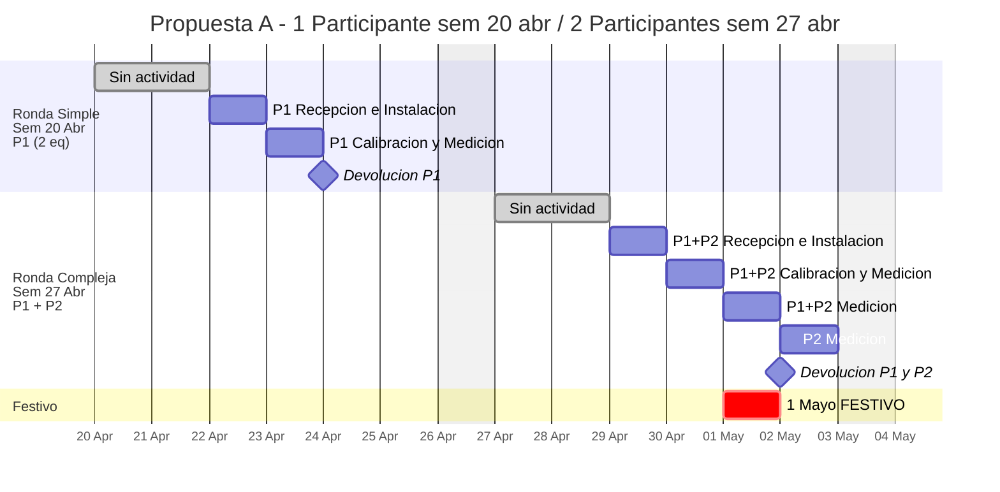

```mermaid
---
config:
  gantt:
    numberSectionStyles: 3
    barHeight: 22
    fontSize: 12
---
gantt
    title Propuesta A - 1 Participante sem 20 abr / 2 Participantes sem 27 abr
    dateFormat YYYY-MM-DD
    axisFormat %d %b
    tickInterval 1day
    excludes sunday

    section Ronda Simple<br/>Sem 20 Abr <br/> P1 (2 eq)
    Sin actividad                     :done, 2026-04-20, 2d
    P1 Recepcion e Instalacion        :2026-04-22, 1d
    P1 Calibracion y Medicion         :2026-04-23, 1d
    Devolucion P1                     :milestone, 2026-04-24, 0d

    section Ronda Compleja<br/>Sem 27 Abr <br/> P1 + P2
    Sin actividad                     :done, 2026-04-27, 2d
    P1+P2 Recepcion e Instalacion     :2026-04-29, 1d
    P1+P2 Calibracion y Medicion      :2026-04-30, 1d
    P1+P2 Medicion                    :2026-05-01, 1d
    P2 Medicion                       :2026-05-02, 1d
    Devolucion P1 y P2                :milestone, 2026-05-02, 0d

    section Festivo
    1 Mayo FESTIVO                    :crit, 2026-05-01, 1d
```
