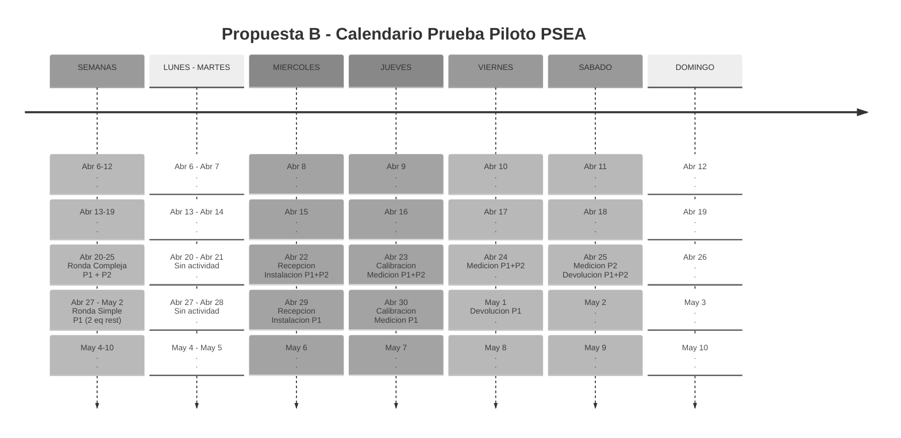

```mermaid
%%{init: {"theme": "base", "themeVariables": {"cScale0": "#9a9a9a", "cScale1": "#eeeeee", "cScale2": "#888888", "cScale3": "#888888", "cScale4": "#999999", "cScale5": "#999999", "cScale6": "#eeeeee"}}}%%
timeline
    title Propuesta B - Calendario Prueba Piloto PSEA
    SEMANAS        : Abr 6-12 <br> . <br> .
                   : Abr 13-19 <br> . <br> .
                   : Abr 20-25 <br> Ronda Compleja <br> P1 + P2
                   : Abr 27 - May 2 <br> Ronda Simple <br> P1 (2 eq rest)
                   : May 4-10 <br> . <br> .
    LUNES - MARTES : Abr 6 - Abr 7 <br> . <br> .
                   : Abr 13 - Abr 14 <br> . <br> .
                   : Abr 20 - Abr 21 <br> Sin actividad <br> .
                   : Abr 27 - Abr 28 <br> Sin actividad <br> .
                   : May 4 - May 5 <br> . <br> .
    MIERCOLES      : Abr 8 <br> . <br> .
                   : Abr 15 <br> . <br> .
                   : Abr 22 <br> Recepcion <br> Instalacion P1+P2
                   : Abr 29 <br> Recepcion <br> Instalacion P1
                   : May 6 <br> . <br> .
    JUEVES         : Abr 9 <br> . <br> .
                   : Abr 16 <br> . <br> .
                   : Abr 23 <br> Calibracion <br> Medicion P1+P2
                   : Abr 30 <br> Calibracion <br> Medicion P1
                   : May 7 <br> . <br> .
    VIERNES        : Abr 10 <br> . <br> .
                   : Abr 17 <br> . <br> .
                   : Abr 24 <br> Medicion P1+P2 <br> .
                   : May 1 <br> Devolucion P1 <br> .
                   : May 8 <br> . <br> .
    SABADO         : Abr 11 <br> . <br> .
                   : Abr 18 <br> . <br> .
                   : Abr 25 <br> Medicion P2 <br> Devolucion P1+P2
                   : May 2 <br> . <br> .
                   : May 9 <br> . <br> .
    DOMINGO        : Abr 12 <br> . <br> .
                   : Abr 19 <br> . <br> .
                   : Abr 26 <br> . <br> .
                   : May 3 <br> . <br> .
                   : May 10 <br> . <br> .
```
