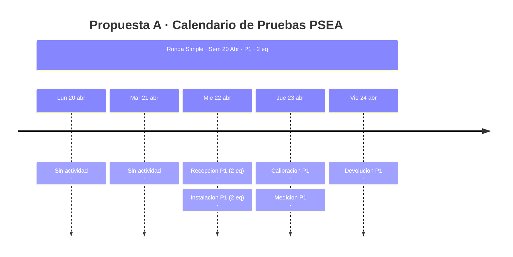
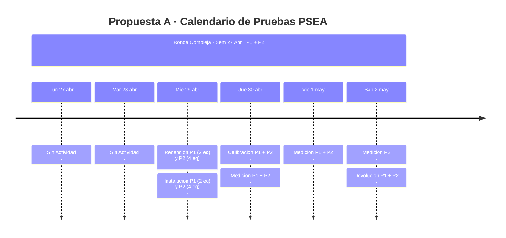

```mermaid
timeline
    title Propuesta A · Calendario de Pruebas PSEA
    section Ronda Simple · Sem 20 Abr · P1 · 2 eq
        Lun 20 abr : Sin actividad <br> .
        Mar 21 abr : Sin actividad <br> .
        Mie 22 abr : Recepcion P1 (2 eq)<br> .: Instalacion P1 (2 eq)<br> .
        Jue 23 abr : Calibracion P1<br> .: Medicion P1<br> .
        Vie 24 abr : Devolucion P1<br> .
```

```mermaid
timeline
    title Propuesta A · Calendario de Pruebas PSEA
    section Ronda Compleja · Sem 27 Abr · P1 + P2
        Lun 27 abr : Sin Actividad <br> .
        Mar 28 abr : Sin Actividad <br> .
        Mie 29 abr : Recepcion P1 (2 eq) y P2 (4 eq)<br> .: Instalacion P1 (2 eq) y P2 (4 eq)<br> .
        Jue 30 abr : Calibracion P1 + P2<br> .: Medicion P1 + P2<br> .
        Vie 1 may  : Medicion P1 + P2<br> .
        Sab 2 may  : Medicion P2<br> .: Devolucion P1 + P2<br> .
```
