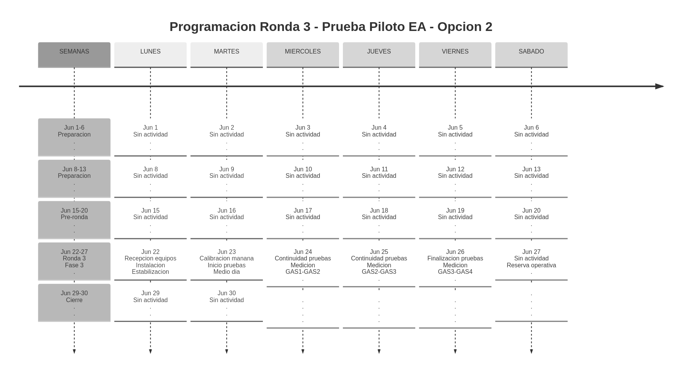
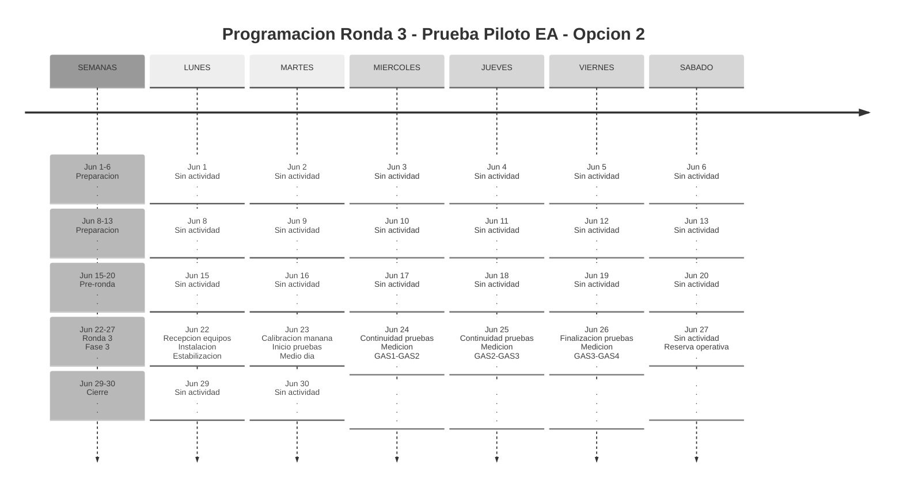

# Timeline Ronda 3 - Fase 3

Escenarios operativos para la [[Ronda 3]] durante la semana del 22 al 26 de junio de 2026.

## Opcion 1 - Calibracion completa el martes

## Opcion 2 - Inicio de pruebas el martes al medio dia

