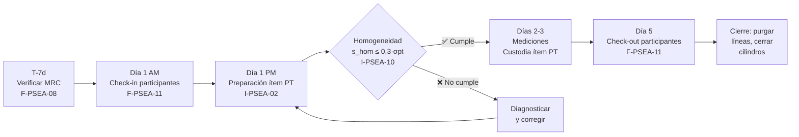

# P-PSEA-10 — Procedimiento de Manejo de Ítems PT

**Código:** P-PSEA-10  
**Nivel:** 3 — Procedimiento Técnico del Esquema  
**Estado:** skeleton  
**Versión:** 0.1-draft  
**Cláusulas ISO/IEC 17043:2023:** 7.3.3, 7.3.4  
**Oleada:** 1  
**Prioridad:** 🟠 Alta  
**Ejecuta a través de:** I-PSEA-02 (Producción PT Items), I-PSEA-01 (Embalaje y Transporte)  
**Alimenta a:** F-PSEA-08 (Registro de Preparación del Ítem), F-PSEA-11 (Registro de Envío y Recepción)

---

> **Instrucción general para el redactor:**  
> Este procedimiento cubre el manejo de **dos tipos de ítems PT** en el Esquema CALAIRE-EA:  
> **(A) Ítem PT generado** — la atmósfera gaseosa de concentración conocida producida dinámicamente por CALAIRE y distribuida en el manifold. No se envía ni se desplaza; existe solo durante la ronda.  
> **(B) Cilindros de gases** — los MRC de CALAIRE y los cilindros que traen los participantes. Estos sí requieren identificación, almacenamiento y manejo seguro.  
> La distinción es clave para la correcta aplicación de §7.3.3 (preparación) y §7.3.4 (transporte/entrega) de ISO/IEC 17043:2023.

---

## 1. Objeto

Definir las condiciones de preparación, identificación, almacenamiento, custodia y manejo seguro de los ítems de ensayo de aptitud del Esquema CALAIRE-EA, incluyendo los materiales de referencia certificados (MRC), los cilindros de gases y las atmósferas generadas dinámicamente, desde su recepción o generación hasta el cierre de cada ronda.

---

## 2. Alcance

Aplica a:
- **MRC y cilindros de CALAIRE:** gases patrón certificados utilizados como fuente para la generación del ítem PT
- **Cilindros de los participantes:** gases que los participantes traen para su calibración interna durante la ronda
- **Ítem PT generado:** atmósfera dinámica distribuida por el manifold durante las mediciones
- **Equipos de generación:** calibrador dinámico, fotómetro O₃, generador de ozono, manifold de vidrio

No cubre: el procedimiento técnico detallado de generación de atmósferas (→ I-PSEA-02), el embalaje de instrumentos de los participantes (→ I-PSEA-01), ni el manejo de residuos químicos (→ procedimiento de seguridad de la U).

---

## 3. Referencias

| Norma / Documento | Cláusula / Sección | Aspecto |
|---|---|---|
| ISO/IEC 17043:2023 | 7.3.3 | Preparación de ítems PT |
| ISO/IEC 17043:2023 | 7.3.4 | Transporte, despacho y recepción de ítems |
| ISO/IEC 17043:2023 | 7.3.4.4 | Manejo de ítems peligrosos |
| ISO 13528:2022 | 5.2, 5.4 | Preparación del valor asignado; homogeneidad y estabilidad |
| DG-PSEA-01 | completo | Protocolo general del esquema |
| I-PSEA-02 | completo | Producción de atmósferas (ejecución técnica) |
| I-PSEA-10 | completo | Homogeneidad y estabilidad |
| I-PSEA-01 | completo | Embalaje y transporte de instrumentos |
| F-PSEA-08 | completo | Registro de preparación del ítem |
| F-PSEA-11 | completo | Registro de envío y recepción |

---

## 4. Definiciones

| Término | Definición |
|---|---|
| **Ítem PT** | La atmósfera gaseosa de concentración conocida generada dinámicamente por CALAIRE y distribuida simultáneamente a todos los analizadores conectados al manifold |
| **MRC (Material de Referencia Certificado)** | Cilindro de gas patrón con concentración certificada y trazabilidad metrológica, que sirve como fuente primaria para la generación del ítem PT |
| **Cilindro de calibración del participante** | Cilindro de gas que el participante trae para realizar su propia calibración interna (cero, span) antes de las mediciones. No es el ítem PT |
| **Manifold** | Sistema de distribución de vidrio inerte que reparte el ítem PT homogéneamente a todos los puertos de medición |
| **Punto de entrega** | El puerto de teflón 1/4" del manifold asignado a cada participante. Es el punto donde el ítem PT "llega" al participante |
| **Cadena de custodia** | Trazabilidad documental desde la recepción o preparación del ítem hasta el cierre de la ronda |

---

## 5. Responsabilidades

| Rol | Responsabilidades |
|---|---|
| **Coordinador EA** | Gestionar recepción, almacenamiento y custodia de MRC; verificar vigencia de certificados; asignar puertos del manifold |
| **Técnico CALAIRE** | Ejecutar la preparación y generación del ítem PT (→ I-PSEA-02); verificar homogeneidad y estabilidad; operar el manifold |
| **Participante** | Transportar sus propios cilindros de calibración cumpliendo la normativa; declarar equipos en F-PSEA-05A §3; custodiar sus materiales durante la ronda |
| **Responsable SGC** | Verificar que los registros de cadena de custodia están completos antes del cierre de la ronda |

---

## 6. Procedimiento

### 6.1 Recepción y verificación de MRC de CALAIRE (pre-ronda)

> **Instrucción:** Completar con el proveedor actual del MRC, número de lote y certificado vigente. Consultar I-PSEA-08 para los parámetros del CRM en uso.

**Plazo:** T-7 días antes de la ronda

1. Verificar que el MRC a utilizar tiene **certificado de análisis vigente** (fecha de vencimiento posterior al último día de la ronda).
2. Registrar en F-PSEA-08:

   | Campo | Valor |
   |---|---|
   | Proveedor | [___] |
   | Gas / Analito | [___] |
   | Concentración certificada | [___] nmol/mol o µmol/mol |
   | Incertidumbre certificada u_CRM (k=2) | [___] |
   | Número de lote / cilindro | [___] |
   | Número de certificado | [___] |
   | Fecha de vencimiento del certificado | [___] |
   | Organismo de acreditación del proveedor | [___] |

3. Verificar la **presión del cilindro** (mínimo: [___ bar] para garantizar estabilidad durante toda la ronda).
4. Verificar ausencia de fugas en válvula y regulador.
5. Si el certificado está vencido o la presión es insuficiente → **detener** y gestionar sustitución antes de continuar. Notificar al Coordinador EA.

---

### 6.2 Almacenamiento de cilindros (CALAIRE y participantes)

> **Instrucción:** Especificar la ubicación física de almacenamiento en el laboratorio (sala, rack, condiciones T/P/HR).

**Condiciones de almacenamiento:**

| Condición | Requisito |
|---|---|
| Posición | Vertical, asegurados con cadena o soporte anti-caída |
| Temperatura ambiente | [10–40 °C] — alejados de fuentes de calor |
| Ventilación | Área ventilada; no almacenar en espacios confinados sin ventilación |
| Acceso | Restringido al personal autorizado del laboratorio |
| Identificación | Etiqueta con: código interno CALAIRE, analito, concentración, fecha vencimiento certificado |
| Separación | Cilindros llenos separados de vacíos; oxidantes separados de combustibles |

**Cilindros de los participantes:**
- Al llegar, el Técnico CALAIRE asigna un área de almacenamiento designada a cada participante.
- El participante es responsable del aseguramiento y custodia de sus propios cilindros.
- Los cilindros de los participantes **no deben conectarse al manifold** ni al sistema de generación de CALAIRE.

---

### 6.3 Preparación del ítem PT (ejecución técnica)

> **Instrucción:** Este paso ejecuta I-PSEA-02. Aquí se documenta cuándo y quién autoriza el inicio.

**Día de preparación:** Día 1 (miércoles) — antes de las conexiones de los participantes

1. El Técnico CALAIRE verifica que el sistema de generación está operativo: calibrador dinámico, generador O₃ (si aplica), fotómetro referencia, manifold, líneas de teflón.
2. El Coordinador EA autoriza el inicio de la preparación del ítem PT una vez que todos los analizadores de los participantes están instalados y conectados al manifold.
3. Ejecutar procedimiento de generación → **I-PSEA-02**.
4. Ejecutar verificación de homogeneidad → **I-PSEA-10** §6.1.
5. Registrar en F-PSEA-08: setpoints, concentración generada, caudales, T/P/HR, resultado de homogeneidad.
6. Si homogeneidad no cumple criterio (s_hom > 0,3·σ_pt) → **no iniciar mediciones**; diagnosticar causa (fuga, contaminación de línea, problema del manifold) y corregir.

---

### 6.4 Custodia del ítem PT durante las mediciones

> **Instrucción:** Describir las condiciones que deben mantenerse durante toda la secuencia de medición.

1. El Técnico CALAIRE permanece en el laboratorio durante todas las sesiones de medición.
2. Nadie, excepto el Técnico CALAIRE, puede ajustar los controles del calibrador dinámico, fotómetro o generador de ozono.
3. Las **líneas de teflón del manifold** no deben desconectarse entre niveles de concentración ni entre días de medición, salvo por autorización del Técnico CALAIRE (ej. cambio de gas).
4. Al cambiar de analito (ej. O₃ → NO), el Técnico CALAIRE ejecuta el protocolo de purga y estabilización definido en I-PSEA-02 antes de iniciar las mediciones del nuevo analito.
5. Verificar estabilidad del ítem PT al inicio de cada nivel: la concentración debe mantenerse dentro de [±X%] durante los primeros [Y] minutos. Si no estabiliza → esperar o diagnosticar. Registrar en F-PSEA-08.

---

### 6.5 Recepción de cilindros de los participantes (check-in)

> **Instrucción:** Este paso formaliza la recepción de los equipos y materiales del participante al llegar al laboratorio. Es la ejecución del F-PSEA-11.

**Día de llegada:** Día 1 (miércoles)

1. Al llegar el participante, el Coordinador EA contrasta los equipos y cilindros traídos contra lo declarado en **F-PSEA-05A §2 y §3**.
2. Si hay discrepancia (equipo no declarado, cilindro adicional, equipo diferente al declarado) → registrar la discrepancia en F-PSEA-11 y evaluar si puede participar con el equipo presente.
3. Registrar en F-PSEA-11:
   - Código del participante
   - Lista de analizadores recibidos (modelo, serial)
   - Lista de cilindros recibidos (analito, concentración declarada, certificado vigente Sí/No)
   - Lista de equipos auxiliares recibidos
   - Condición de llegada (sin daños aparentes)
   - Hora de llegada y firma del participante
4. Asignar puesto de trabajo en el manifold (Puerto #[___]) y registrar en F-PSEA-07 §6.

---

### 6.6 Devolución de materiales y cierre (check-out)

> **Instrucción:** Al finalizar la ronda, verificar que el participante retira todos sus materiales y que el laboratorio queda en condiciones para la siguiente ronda.

**Día de cierre:** Día 5 (lunes)

1. El participante desmonta su analizador y desconecta sus líneas del manifold bajo supervisión del Técnico CALAIRE.
2. Verificar que el participante retira **todos** sus materiales (cilindros, cables, herramientas, computadores).
3. El Coordinador EA y el participante firman el F-PSEA-11 como constancia de devolución sin novedad.
4. Si algún equipo queda olvidado o hay daño → documentar en F-PSEA-11 y notificar al participante.
5. Técnico CALAIRE: cerrar válvulas de MRC de CALAIRE, purgar líneas del manifold y dejar el sistema en condición de reposo.
6. Actualizar F-PSEA-07: columna "Ronda completada" → Sí.

---

### 6.7 Manejo de situaciones especiales

> **Instrucción:** Completar con los protocolos de respuesta ante estas situaciones. Consultar el protocolo de seguridad de la Universidad para emergencias con gases.

| Situación | Acción |
|---|---|
| Fuga de gas detectada | Cerrar válvula del cilindro afectado de inmediato; ventilar el área; evacuar si es necesario; notificar coordinación de la Universidad; registrar en F-PSEA-08 y abrir NC en F-PSEA-15 |
| MRC con certificado vencido | Suspender generación con ese cilindro; sustituir por MRC de reserva si disponible; si no hay reserva, suspender ronda y notificar a participantes; registrar NC |
| Concentración generada fuera de setpoint (>±[X]%) | Registrar en F-PSEA-08; diagnosticar causa; no iniciar mediciones hasta resolver; si no se resuelve, suspender nivel y documentar |
| Cilindro del participante con fuga | Coordinador EA asiste al participante; si no se puede reparar in situ, el participante opera sin ese cilindro o se retira de la ronda |
| Daño al analizador de un participante durante la ronda | Documentar en F-PSEA-11 con firma de ambas partes; escalar a Coordinador EA y Director del Proyecto; determinar responsabilidad según las condiciones de participación |

---

## 7. Criterios de aceptación

| Criterio | Condición | Resultado |
|---|---|---|
| Certificado MRC vigente | Vencimiento posterior al último día de la ronda | ✅ / ❌ |
| Homogeneidad del ítem PT | s_hom ≤ 0,3·σ_pt antes de iniciar mediciones (→ I-PSEA-10) | ✅ / ❌ |
| Check-in completo | F-PSEA-11 firmado por participante y Técnico CALAIRE | ✅ / ❌ |
| Cadena de custodia | F-PSEA-08 completado para cada nivel y cada analito | ✅ / ❌ |
| Check-out completo | F-PSEA-11 cierre firmado; ningún material del participante sin retirar | ✅ / ❌ |

---

## 8. Registros

| Formato | Descripción | Cuándo |
|---|---|---|
| F-PSEA-08 | Registro de Preparación del Ítem — MRC, dilución, concentración, T/P/HR | Por nivel, por analito, por ronda |
| F-PSEA-11 | Registro de Envío y Recepción — check-in y check-out de equipos del participante | Al inicio y cierre de cada ronda |
| F-PSEA-15 | Registro de No Conformidades | Cuando aplique (situaciones §6.7) |
| Certificados MRC archivados | Copia del certificado del lote usado | Por ronda |

---

## 9. Flujo simplificado del manejo del ítem PT

---

## Control de versiones

| Versión | Fecha | Descripción del cambio | Elaboró | Revisó | Aprobó |
|---|---|---|---|---|---|
| 0.1 | 2026-04-08 | Skeleton inicial — adaptado para esquema in situ | [Nombre] | — | — |
| 1.0 | [FECHA] | Versión para prueba piloto — parámetros de sistema completados | [Nombre] | [Nombre] | [Nombre] |
